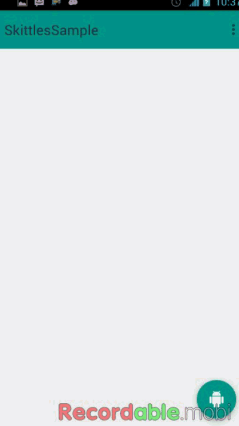

#Skittles

A simple,clean api for adding PushBullet style skittles to your app for more material design glory.This library uses the <a href="https://developer.android.com/reference/android/support/design/widget/FloatingActionButton.html">FloatingActionButton</a> provided in the android design support library




##Guide

First some housekeeping code:

Use
[SkittleLayout](library/src/main/java/snow/skittles/SkittleLayout.java) as a root view in your layouts

```
<snow.skittles.SkittleLayout xmlns:android="http://schemas.android.com/apk/res/android"
xmlns:tools="http://schemas.android.com/tools"
android:id="@+id/skittleLayout"
android:layout_width="match_parent"
android:layout_height="match_parent"
tools:context=".MainActivity">

<android.support.v7.widget.Toolbar
android:id="@+id/toolbar"
android:layout_width="match_parent"
android:layout_height="?attr/actionBarSize"
android:layout_alignParentTop="true"
android:background="?attr/colorPrimary"
android:minHeight="?attr/actionBarSize" />

...

</snow.skittles.SkittleLayout>
```

Some further housekeeping...

Declare a [SkittleBuilder](library/src/main/java/snow/skittles/SkittleBuilder.java),used to add skittles and pass the root SkittleLayout to it

```
SkittleLayout skittleLayout = (SkittleLayout) findViewById(R.id.skittleLayout);
SkittleBuilder skittleBuilder = new SkittleBuilder(this, skittleLayout, false, R.color.material_deep_purple_500, R.color.material_deep_teal_500);

```

Now for the fun part

Add skittles to your activity/fragment

```
skittleBuilder.addSkittle(getResources().getDrawable(R.drawable.ic_link_white_18dp));

skittleBuilder.addSkittle(getResources().getDrawable(R.drawable.ic_add_white_18dp));

skittleBuilder.addSkittle(getResources().getDrawable(R.drawable.ic_create_white_18dp));
```

A bit more work for adding [Text Skittle](library/src/main/java/snow/skittles/TextSkittle.java)

```
TextSkittle textSkittle = skittleBuilder.makeTextSkittle(getResources().getDrawable(R.drawable.ic_link_white_18dp), "Jon is alive");
skittleBuilder.addTextSkittle(textSkittle);

textSkittle=skittleBuilder.makeTextSkittle(getResources().getDrawable(R.drawable.ic_add_white_18dp), "Boltons will die");
skittleBuilder.addTextSkittle(textSkittle);

textSkittle=skittleBuilder.makeTextSkittle(getResources().getDrawable(R.drawable.ic_create_white_18dp), "Cleganebowl");
skittleBuilder.addTextSkittle(textSkittle);
```

Flexible callback for clicks:

+ Add a click listener(SkittleBuilder.SkittleClickListener) to the [SkittleBuilder](library/src/main/java/snow/skittles/SkittleBuilder.java) object
`skittleBuilder.setSkittleListener(this);`

+ This exposes two methods for [Skittle](library/src/main/java/snow/skittles/Skittle.java) and [TextSkittle](library/src/main/java/snow/skittles/TextSkittle.java) click events for convenience

```
void onSkittleClick(Skittle skittle);

void onTextSkittleClick(TextSkittle textSkittle);
```

Use `skittle.getPosition()` which return the position of the clicked
skittle starting from **1** and starting from **bottom**

```
public void onSkittleClick(Skittle skittle) {

  switch (skittle.getPosition()) {
    case 1:
    Toast.makeText(this, "Skittle 1", Toast.LENGTH_LONG).show();
    break;
    case 2:
    Toast.makeText(this, "Skittle 2", Toast.LENGTH_LONG).show();
    break;
  }

}
```

Similarly for [Text Skittle](library/src/main/java/snow/skittles/TextSkittle.java)
```
public void onTextSkittleClick(TextSkittle textSkittle) {

  switch (textSkittle.getPosition()) {
    case 3:
    Toast.makeText(this, "Skittle 3", Toast.LENGTH_LONG).show();
  }
}
```

See the **[Sample](sample/src/main/java/snow/skittlessample/MainActivity.java)** and **[JavaDoc](http://aashrairavooru.github.io/Skittles/)** for further guidance

##Upcoming
+ Better support for animations
+ Option for adding skittles by xml (inspired by Navigation View)
+ Test on more devices
+ Upload to Maven Central

**Currently in heavy dev, good enough for playing around**


#Taste the rainbow

